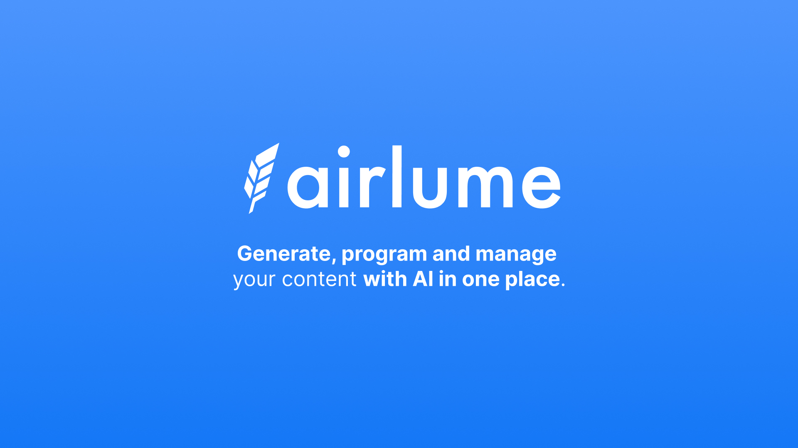
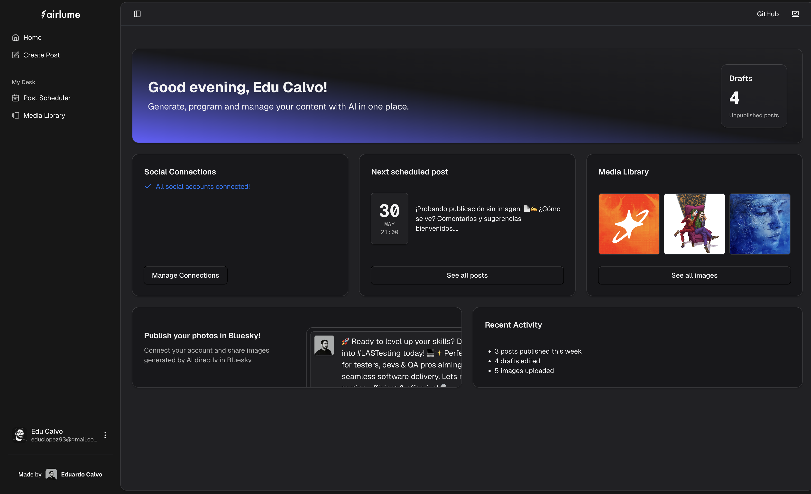
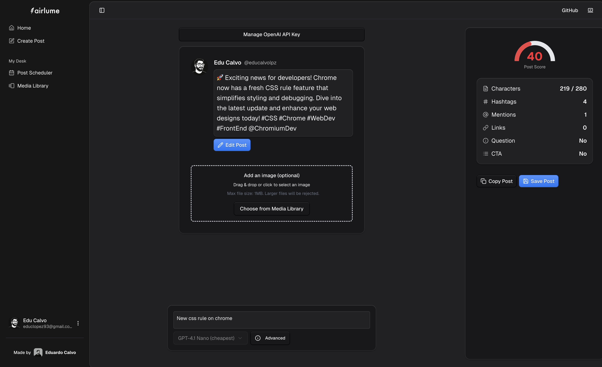
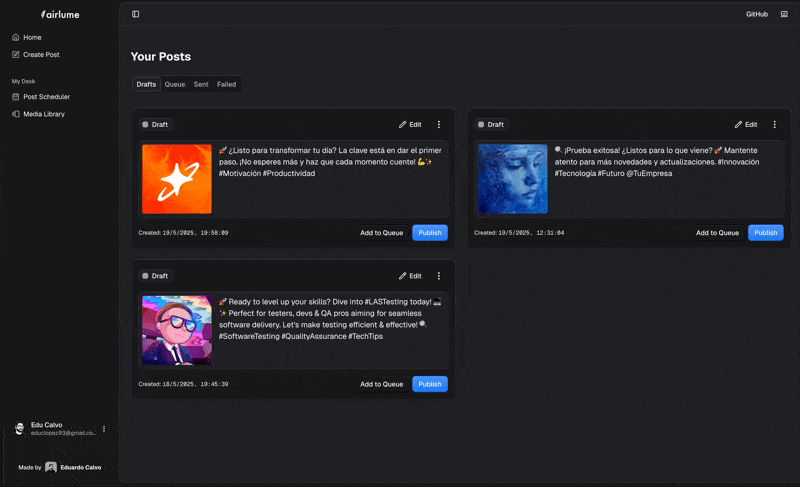

# Airlume

A modern AI-powered tool to generate social media posts using smart presets, reusable prompts, and a streamlined interface.



---

## 🚀 Demo

**Live Demo:** [https://airlume.vercel.app/](https://airlume.vercel.app/)

---

## 🖼️ Screenshots

<p align="center">
  
  <br/>
  <em>Landing Demo</em>
</p>
<p align="center">
  
  <br/>
  <em>Dashboard</em>
</p>
<p align="center">
  
  <br/>
  <em>AI Generator</em>
</p>
<p align="center">
  
  <br/>
  <em>Scheduler</em>
</p>
<p align="center">
  
  <br/>
  <em>Media Library</em>
</p>

---

## ✨ Features

- **AI Content Generation:** Generate high-quality social media posts using OpenAI GPT models.
- **Smart Presets & Prompts:** Modular, reusable prompts for different content types and platforms.
- **User Dashboard:** Manage drafts, scheduled posts, and media assets in a streamlined interface.
- **Social Integrations:** Connect and publish directly to Twitter/X and Bluesky.
- **Media Library:** Store and manage images for your posts.
- **Modern UI:** Built with Next.js App Router, Tailwind CSS v4, and Shadcn/UI for a beautiful, responsive experience.

---

## 🔐 Authentication with Clerk

Authentication and user management are handled by [Clerk.dev](https://clerk.dev/docs):

- **Sign Up & Sign In:** Secure, customizable authentication flows.
- **Session Management:** Persistent sessions across devices.
- **User Profiles:** Users can update their profile, email, password, and manage social connections via Clerk's UI.
- **Social Logins:** Easily connect Twitter/X and Bluesky accounts for seamless publishing.
- **Protected Routes:** All user-specific pages (dashboard, generator, media library, etc.) are protected using Clerk middleware.
- **API Security:** All API routes validate the user via Clerk before performing actions.

_Example:_

```tsx
import { ClerkProvider } from "@clerk/nextjs"

export default function RootLayout({ children }) {
  return (
    <ClerkProvider>
      {/* ... */}
      {children}
    </ClerkProvider>
  )
}
```

---

## 🛠️ Tech Stack

- **Frontend:** Next.js (App Router), Tailwind CSS v4, Shadcn/UI
- **Backend:** Supabase (Edge Functions)
- **Authentication:** Clerk.dev
- **AI Integration:** OpenAI GPT models via Vercel AI SDK
- **Package Manager:** pnpm

---

## 📦 Real Project Structure

```
/
├── public/
│   ├── images/
│   │   └── bg-stripe.png
│   └── opengraph-image.jpg
├── src/
│   ├── app/
│   │   ├── [username]/
│   │   │   ├── generator/
│   │   │   ├── media-library/
│   │   │   ├── posts/
│   │   │   ├── settings/
│   │   │   ├── layout.tsx
│   │   │   └── page.tsx
│   │   ├── api/
│   │   ├── globals.css
│   │   ├── layout.tsx
│   │   ├── page.tsx
│   │   ├── robots.ts
│   │   └── sitemap.ts
│   ├── assets/
│   │   └── images/
│   ├── components/
│   │   ├── landing/
│   │   ├── icons/
│   │   ├── ui/
│   │   ├── app-sidebar.tsx
│   │   ├── copyright.tsx
│   │   ├── dashboard-greeting.tsx
│   │   ├── dashboard-header-gradient.tsx
│   │   ├── logo.tsx
│   │   ├── nav-generations.tsx
│   │   ├── nav-main.tsx
│   │   ├── nav-user.tsx
│   │   ├── site-header.tsx
│   │   ├── theme-switcher.tsx
│   │   └── user-profile-dialog.tsx
│   ├── hooks/
│   │   └── use-mobile.ts
│   ├── lib/
│   │   ├── database.types.ts
│   │   ├── supabaseAdmin.ts
│   │   ├── supabaseClient.ts
│   │   └── utils.ts
│   ├── trigger/
│   │   ├── scheduledPost.ts
│   │   └── .gitkeep
│   ├── middleware.ts
│   └── trigger.ts
├── README.md
└── package.json
```

---

## 🧪 Development

- **Install dependencies:** `pnpm install`
- **Run dev server:** `pnpm dev`
- **Build:** `pnpm build`
- **Lint:** `pnpm lint`

---

## 📝 References

- [Supabase Documentation](https://supabase.com/docs)
- [Clerk Documentation](https://clerk.dev/docs)
- [Shadcn/UI Components](https://ui.shadcn.com/docs)
- [Vercel AI SDK](https://ai-sdk.dev/docs/)
- [OpenAI API Reference](https://platform.openai.com/docs)

---

## 📄 License

Business Source License (see LICENSE file for details)
